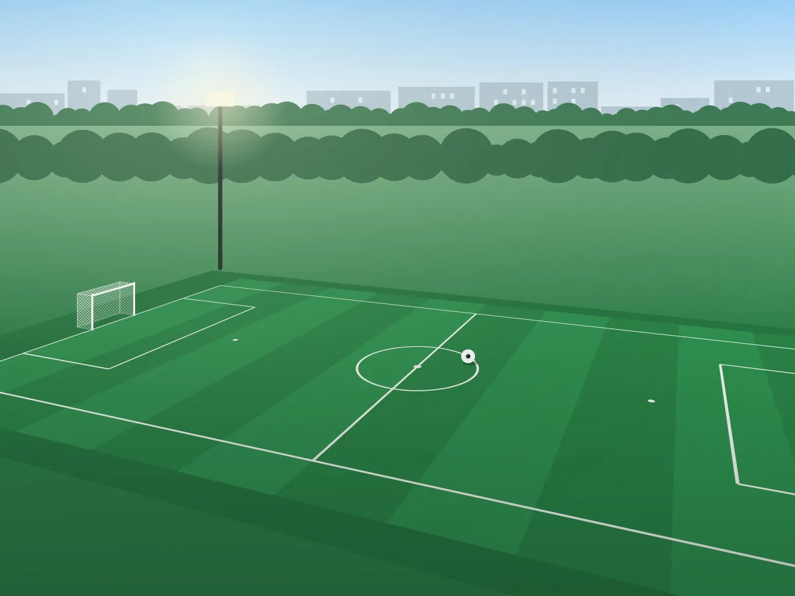

# Courtly — набір ресурсів

Ресурси для лабораторної роботи №7 (Проміжний контроль №1). Почніть із
`SPEC.md`: там сказано, який токен застосовано до кожного елемента макета.
Та сама специфікація онлайн:
<https://denysmatsevych.github.io/web-development-2026/labs/lab-7/task/>

Усі зображення намальовані спеціально для цього завдання. Їх можна вільно
використовувати у своїй роботі та публікувати на GitHub Pages / Vercel.

## Вміст

```text
courtly-assets/
├── SPEC.md                 специфікація: токени, сітка, компоненти, зображення
├── tokens.css              design tokens: кольори, типографіка, відступи, радіуси
├── favicon.svg             іконка вкладки
├── mockup/                 знімки макета 1 : 1 (1 px = 1 CSS px)
│   ├── mockup-desktop.webp 1440 px
│   ├── mockup-tablet.webp  768 px
│   ├── mockup-mobile.webp  375 px
│   └── mockup-mobile-menu.webp  перший екран 375 px, меню відкрите
└── img/
    ├── logo-mark.svg       знак логотипа (40×40); слово «Courtly» — текстом у HTML
    ├── hero-1200.webp      hero, 1200×900
    ├── hero-800.webp       hero, 800×600 — для srcset на вузьких екранах
    ├── arena-sport.webp    featured card, 900×1200 (портрет)
    ├── tennis-point.webp   картка, 800×600
    ├── riverside-court.webp
    ├── smash-club.webp
    ├── city-football.webp
    ├── active-hall.webp
    ├── about.webp          інформаційний блок, 960×1200 (портрет, 4:5)
    └── og-image.jpg        Open Graph, 1200×630
```

## Як підключити

Шрифт — Montserrat з кирилицею (Google Fonts або self-hosted `woff2`):

```html
<link rel="preconnect" href="https://fonts.googleapis.com">
<link rel="preconnect" href="https://fonts.gstatic.com" crossorigin>
<link rel="stylesheet" href="https://fonts.googleapis.com/css2?family=Montserrat:wght@400..800&display=swap">
```

Hero — найбільший елемент першого екрана (LCP), тому **без** `loading="lazy"`:

```html

```

Решта зображень — з `width`, `height` і `loading="lazy"`.

`og:image` вказуйте **абсолютним** URL опублікованого файлу, наприклад
`https://<username>.github.io/<repository>/img/og-image.jpg`.

Текст `alt` напишіть самостійно: він має описувати, що зображено, а не
повторювати назву файла.
